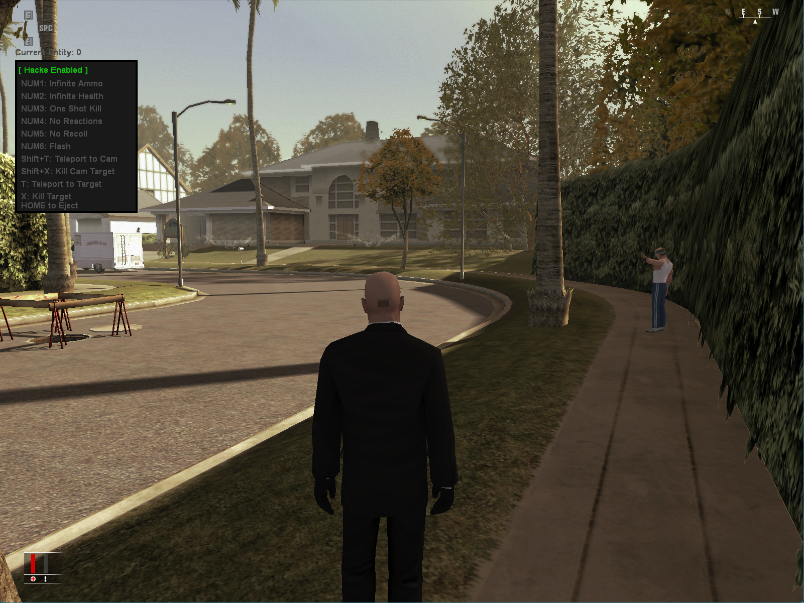

<h1 align="center">Hitman Blood Money Trainer</h1>
<p align="center">
  
  <a href="https://mit-license.org/"/>
    
  </a>
  
</p>
<br>
  
## Overview:

This is a repository for a Hitman Blood Money Trainer that I built with C, C++, and some Assembly.

The main purpose of this project was to get familiar with programming internal GUIs from scratch and  
familiarize myself with process hooking techniques.

[Demonstration](https://www.youtube.com/watch?v=3Xt5_FahKMs)
of God Mode and Teleport hacks.  

## Table of Contents
- [What I Learned](#what-i-learned)
- [How it Works](#how-it-works)
- [Build Instructions](#build-instructions)
- [Known Issues](#known-issues)
- [Goals](#Goals)
  
### What I Learned
[ What the fuck did I actually learn ]

### How it works
The DLL must be injected WHILE the game is running in the foreground.  
It is very finicky and will crash/hang otherwise.

The hacks written are:
- Press <code>Numpad 1</code> to toggle Infinite Ammo.
- Press <code>Numpad 2</code> to toggle Infinite Health.
- Press <code>Numpad 3</code> to toggle No Reactions
- Press <code>Numpad 4</code> to toggle One Shot Kill.
- Press <code>Numpad 5</code> to toggle No Recoil.
- Press <code>Numpad 6</code> to toggle Flash (5x speed hack).
- Press <code>Shift + T</code> to teleport to current camera coordinates.
- Press <code>Shift + X</code> to kill the entity at the current camera coordinates.
- Press <code>T</code> to teleport to current entity.
- Press <code>X</code> to kill the current entity.
- Press <code>[</code> previous entity.
- Press <code>]</code> next entity.
- Press <code>END</code> to eject.

### Known issues
One shot kill currently prevents "Accidental deaths" from counting as killed targets.  
The player has to manually kill them in order for their death to register. This may be  
solvable by changing the one shot op code from <code>mov</code> to <code>xor</code>

There are currently game states that may trigger a crash if cheats are enabled.

These game states include:
- Restarting a mission with cheats enabled (sometimes)

### Usage
Just use your favorite payload injector and throw that bitch in there.  
It works better when the game is windowed.
### Build with Docker + WSL2 (Recommended)
```
git clone https://github.com/0xvpr/HM3-Trainer.git hm3-trainer && cd hm3-trainer
make docker-container
make docker-build
```
- Windows
```powershell
# Go fuck yourself
```

### Goals
 - [x] Find reliable weapon pointer.
 - [x] Find reliable entity list pointer.
 - [x] Find reliable player health pointer.
 - [x] Find a way to prevent teleports from crashing the game.
 - [x] Find reliable 'in game' boolean (or other explicit distinction).
 - [ ] Update player coordinates in real-time (GUI)
 - [ ] Include entity type in GUI main window, just below the entity number.
